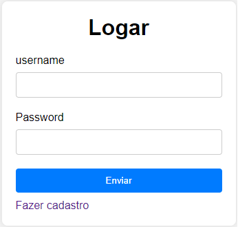
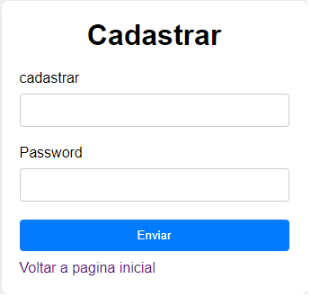
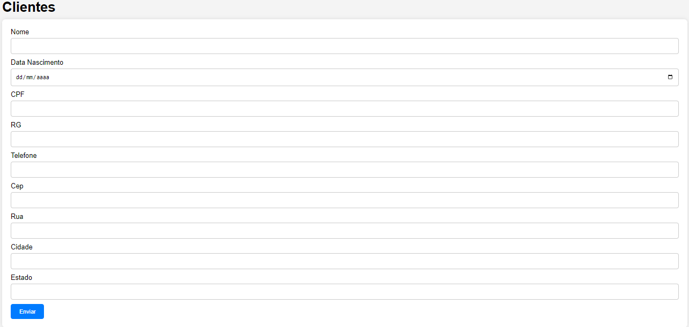
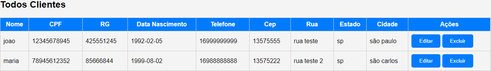
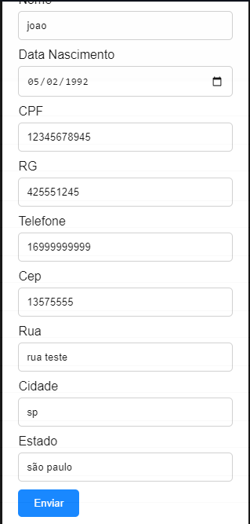

# Sistema CRUD clientes
   

## Índice
- <a href="#-tecnologias-utilizadas"> Tecnologias utilizadas  </a>

- <a href="#funcionalidades"> Funcionalidades </a>
- <a href="#layout"> Layout </a>
- <a href="#como-funciona"> Como funciona este projeto? </a>

## Tecnologias utilizadas

- [x] HTML
- [x] CSS
- [x] JavaScript
- [x] PHP
- [x] SQL

## Layout

#### Formulario de login


#### Formulario de cadastro


#### Botão para deslogar


#### Formulario para cadastrar clientes


#### Tabela de clientes


#### Botão para editar ou excluir clientes


#### Tabela para editar os clientes


## Como funciona este projeto

```bash 
# Clone este repositorio 
https://github.com/adriannparanhos/CRUD-Cliente/tree/main

# Acesse a pasta em seu terminar usando os diretorios
# ou o comando cd pelo cmd

# A aplicação consome a API sendo necessario a instalação do ambiente XAMPP
https://www.apachefriends.org/pt_br/index.html

# Inicialize o Apache e o MySQL

# A aplicação deverá ser inicializada na porta 3306
# Aloque a parte do backend no htdocs que pertence ao Xampp

# Acesse o endereço localhost/nomeDoDiretorio

```
